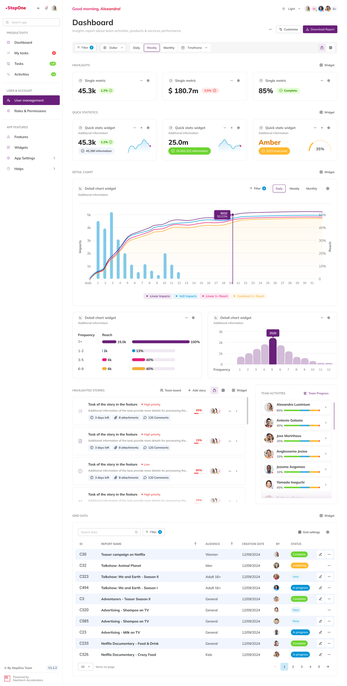

Also known as the NashTech Design System

Welcome to NT Sketchbook, the repository designed to empower designers and developers to bring their creative visions to life with ease and efficiency.

## Table of Contents

-   [Overview](#Overview)
-   [Get started](#get-started)
-   [Contributing](#contributing)
-   [License](#license)

## Overview

NT Sketchbook is your ultimate tool for application development. We provide:

-   [NT Stylesheet Docs](apps/nt-stylesheet/docs/README.md).: A CSS framework delivered with NashTech Design Style Guides as the default theme (nt-theme).
-   NT UI Components: A set of prebuilt components include buttons, labels, inputs, etc.
-   CLI: Utilities for application scaffolding and component management.

## Get Started

## Contributing

Join our vibrant community of creators! Your contributions can make a significant impact. Here’s how to get involved:

1. **Fork the Repository.**
2. **Create Your Feature Branch:**

-   Check [GIT](GIT.md) conversion for more details

3. **Open a Pull Request.**

For detailed steps on adding new components, see our [How-Tos](HOWTOS.md).

## License

This project is proudly licensed under the MIT License. For more details, see the [LICENSE](LICENSE.md) file.
